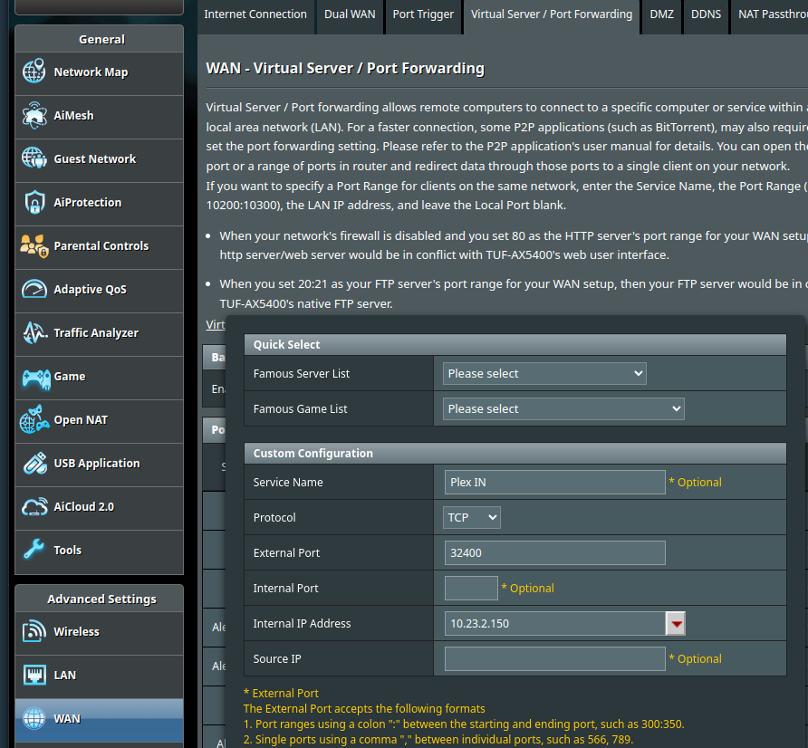

# Plex Stack

This is a complete Plex setup using Docker, with all the necessary tools for automating download/organization of libraries. Overseerr is used for user requests, and Tautulli for monitoring usage.

## Requirements

* Linux
* Docker
* Public IP address (for external access to Plex)

## Preparation

### Network

You must have a public IP address in order to access Plex over the internet using this guide. The easiest way to check, is to log in to your router and look at it's WAN/Internet address. If it starts with anything <b>other</b> than these, you have a public IP address:

* 10.X.X.X
* 172.16.X.X - 172.31.X.X
* 192.168.X.X
* 100.X.X.X

Once you know you have a public IP, you need to open a port to your servers local IP (port forwarding). Plex uses port 32400 TCP. This is an example how to do it in an Asus router:

</img>

### Software installation

#### Docker Engine
Visit https://docs.docker.com/engine/install/ for details on how to install Docker on your distribution.

1. Clone the repo:
<br><br>
```
cd /opt
git clone https://github.com/btstromberg/plex-stack.git
cd plex-stack
```

2. Now make a copy of the example env file and open it in a text editor:

```
cp .env.example .env
nano .env
```

3. Change the config according to your needs. The last line is for the Plex token, keep in mind that it is only valid for 4 minutes after generation (you can generate a new one if it expires too quickly)

4. Start the stack:

```
docker compose -f /opt/plex-stack/docker-compose.yml up --detach
```

5. Go to `http://localipofserver:32400/web` and log in with your Plex account to claim the server